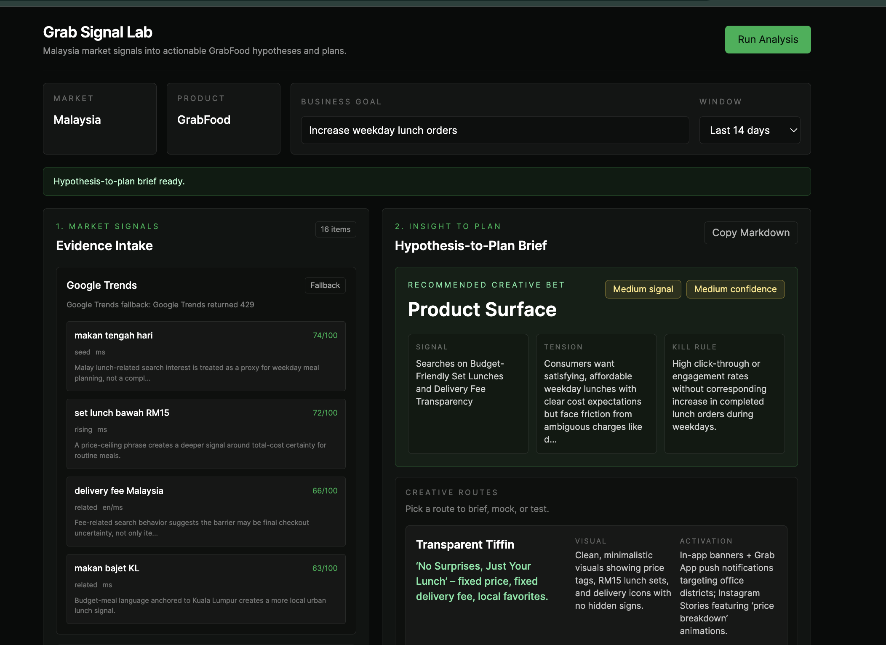
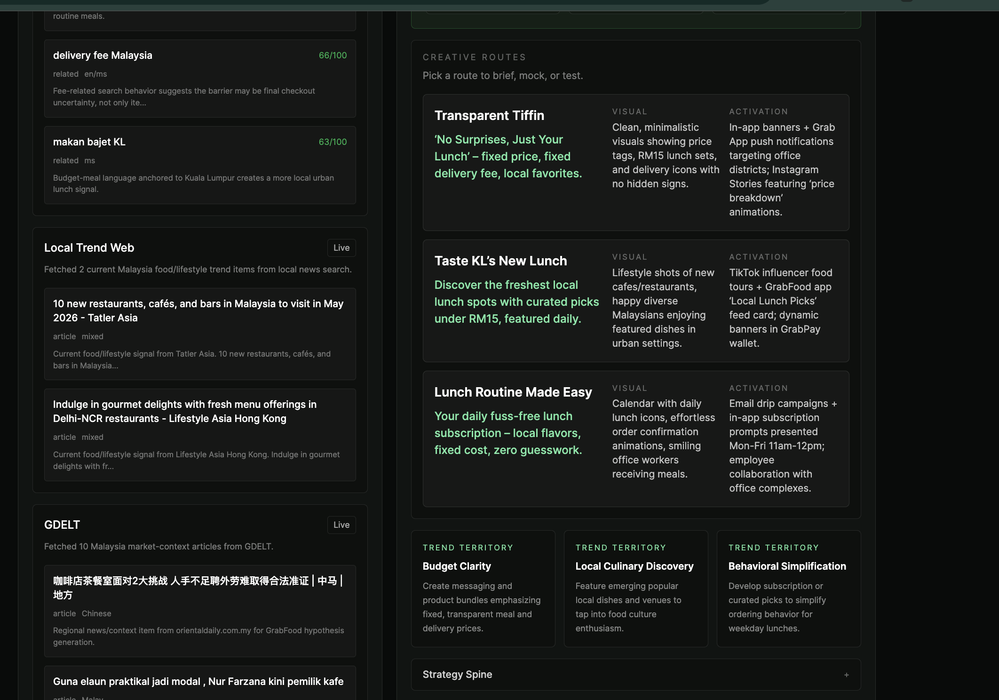

<div align="center">
  <h1>Grab Signal Lab 🧪</h1>

  **Turn Malaysia market signals into actionable GrabFood hypotheses and test plans.**

  [](https://nextjs.org/)
  [](https://react.dev/)
  [](https://www.typescriptlang.org/)
  [](https://tailwindcss.com/)
  [](https://openai.com/)
</div>

---

## 📖 Overview

**Grab Signal Lab** is an internal concept tool designed to bridge the gap between raw market data and creative strategy. Rather than staring at isolated trend graphs or news articles, product marketers can use this tool to automatically ingest live signals from Malaysia and synthesize them into a highly structured, testable **Hypothesis-to-Plan Brief**.

The application actively mines localized search intent (Google Trends), regional news context (GDELT), and local lifestyle web signals. It then feeds this evidence into a constrained LLM pipeline that is strictly prompted to avoid generic advice—instead outputting non-obvious consumer tensions, rejected obvious answers, and concrete creative bets (Messaging, Product Surface, Behavioral).

## 📸 Interface

<div align="center">
  
  <p><em>The main dashboard: Market signals are ingested on the left, while the LLM synthesizes a structured strategy brief on the right.</em></p>
</div>

<br/>

<div align="center">
  
  <p><em>The Brief view: Detailed creative routes, visual directions, and activation plans generated directly from the live market signals.</em></p>
</div>

---

## ✨ Key Features

- **Live Multi-Source Ingestion:** Automatically fetches data from Google Trends (Malaysia `geo:MY`), GDELT (regional news), and local lifestyle RSS feeds.
- **Graceful Degradation:** If external APIs rate-limit or fail, the app seamlessly falls back to curated, high-quality mock data so the demo never breaks.
- **Strict Strategy Synthesis:** The OpenAI pipeline uses the `gpt-4.1-mini` model with a highly constrained JSON schema to enforce strategic rigor (e.g., forcing the AI to explicitly name and reject the "obvious" answer before proposing creative bets).
- **Streaming UI:** Real-time NDJSON streaming keeps the user informed of the pipeline's progress (Scanning → Synthesizing → Complete).
- **One-Click Export:** Instantly copy the entire generated brief as clean Markdown for pasting into Notion, Jira, or Google Docs.

## 🛠️ Tech Stack

- **Framework:** Next.js 15 (App Router)
- **Styling:** Tailwind CSS with a custom dark-mode, Grab-inspired color palette.
- **Language:** Strict TypeScript
- **AI Integration:** OpenAI API (`/v1/responses`) using structured JSON outputs.
- **Data Sources:** Undocumented Google Trends endpoints, GDELT Doc API, and Google News RSS.

## 🚀 Local Setup

To run the Grab Signal Lab locally, you only need an OpenAI API key. The other data sources (Google Trends, GDELT, RSS) are fetched publicly.

### 1. Clone & Install
```bash
git clone https://github.com/limchinhan123/grab-signal-lab.git
cd grab-signal-lab
npm install
```

### 2. Configure Environment
Create a `.env` file in the root directory:
```bash
cp .env.example .env
```
Open `.env` and add your OpenAI key:
```env
OPENAI_API_KEY="sk-proj-your-key-here"
OPENAI_MODEL="gpt-4.1-mini" # Or gpt-4o
```

### 3. Run the Development Server
```bash
npm run dev
```
Open [http://localhost:3000](http://localhost:3000) in your browser.

## ⚠️ Disclaimer

This is an independent, conceptual prototype built for demonstration purposes. It is not affiliated with, sponsored by, or endorsed by Grab. All generated strategies are AI-synthesized hypotheses based on public data.
